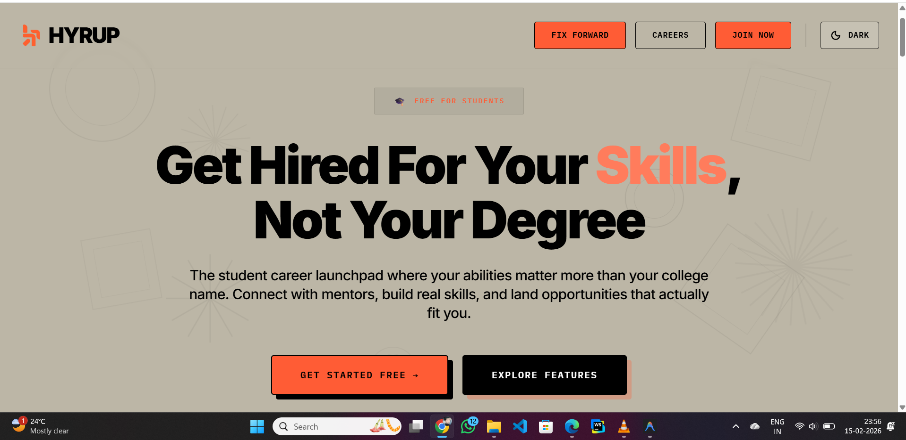
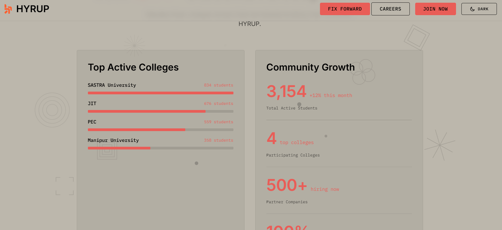
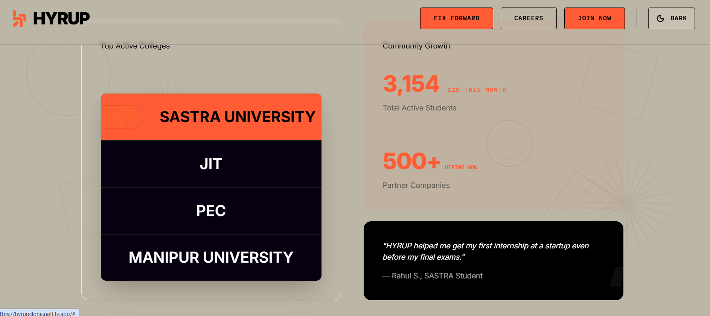
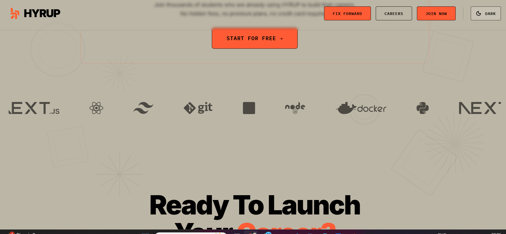

<!DOCTYPE html>
<html lang="en">
<head>
<meta charset="UTF-8">
<title>Hyrup Clone – Project Documentation</title>

</head>
<body>

<h1>🚀 Hyrup Clone – Antigravity Landing Page</h1>

High-fidelity frontend clone with performance optimization, responsiveness,
and creative animation enhancements.

<h2>🔧 Project Setup (Run Locally)</h2>

<pre><code>npm install
npm run dev</code></pre>

Open in browser:

<pre><code>http://localhost:3001</code></pre>

<h2>🛠 Technologies Used & Why</h2>

<ul>
<li><strong>React (TypeScript)</strong> – Type safety and scalable architecture.</li>
<li><strong>Vite</strong> – Fast development server and optimized builds.</li>
<li><strong>Tailwind CSS</strong> – Utility-first responsive styling.</li>
<li><strong>React.lazy + Suspense</strong> – Code splitting to improve initial load performance.</li>
</ul>

<h2>🎨 Asset Extraction Process</h2>

<ul>
<li>Extracted images using browser DevTools (Network tab).</li>
<li>Converted assets into optimized WebP format.</li>
<li>Identified fonts using browser inspection tools.</li>
<li>Extracted color palette and mapped into Tailwind configuration.</li>
<li>Recreated some graphics using SVG/CSS for performance and scalability.</li>
</ul>

<h2>⚠ Challenges & Solutions</h2>

<h3>1. Large Initial Bundle Size</h3>

Implemented React.lazy() for below-the-fold components to reduce initial load time.

<h3>2. Background Layering Issues</h3>

Controlled stacking context using proper positioning and z-index management.

<h3>3. Smooth UI Transitions</h3>

Added transition utilities to improve visual polish during theme changes and interactions.

<h3>4. Responsive Layout Adjustments</h3>

Used mobile-first Tailwind breakpoints (sm, md, lg, xl) to maintain consistent layouts.

<h2>✨ Creative Improvements & Innovations</h2>

<ul>
<li>Infinite Flow Animated Elements (continuous motion effect)</li>
<li>Parallax scrolling effects for depth and immersive feel</li>
<li>Interactive hover animations for enhanced user engagement</li>
<li>Custom Geometric Background component</li>
<li>Lazy-loaded sections with smooth loading spinner</li>
<li>Performance-focused animation approach (lightweight & optimized)</li>
</ul>

<h2>📱 Responsiveness</h2>

Fully responsive across:
<ul>
<li>Mobile devices</li>
<li>Tablets</li>
<li>Laptops</li>
<li>Large desktop screens</li>
</ul>
Designed using a mobile-first approach.

<h2>📊 Performance Optimization</h2>

<ul>
<li>Lazy-loaded non-critical sections</li>
<li>Optimized images (WebP)</li>
<li>Minimal dependency overhead</li>
<li>Efficient component structure</li>
<li>Lightweight animation implementation</li>
</ul>

<h2>🖼 Visual Comparison (Original vs My Version)</h2>

<h3>Comparison 1</h3>
<table>
<tr>
<td>
<h4>Original</h4>

</td>
<td>
<h4>My Version</h4>

</td>
</tr>
</table>

<h3>Comparison 2</h3>
<table>
<tr>
<td>
<h4>Original</h4>

</td>
<td>
<h4>My Version</h4>

</td>
</tr>
</table>

<h3>Comparison 3</h3>
<table>
<tr>
<td>
<h4>Original</h4>

</td>
<td>
<h4>My Version</h4>

</td>
</tr>
</table>

<h2>🤔 Assumptions & Design Decisions</h2>

<ul>
<li>Balanced animation richness with performance efficiency.</li>
<li>Recreated certain design elements for scalability.</li>
<li>Prioritized smooth UX while keeping bundle size optimized.</li>
<li>Structured project for long-term maintainability.</li>
</ul>

<h2>👨‍💻 Author</h2>

Frontend implementation focused on visual precision, responsive design,
animation polish, and performance optimization.

</body>
</html>
